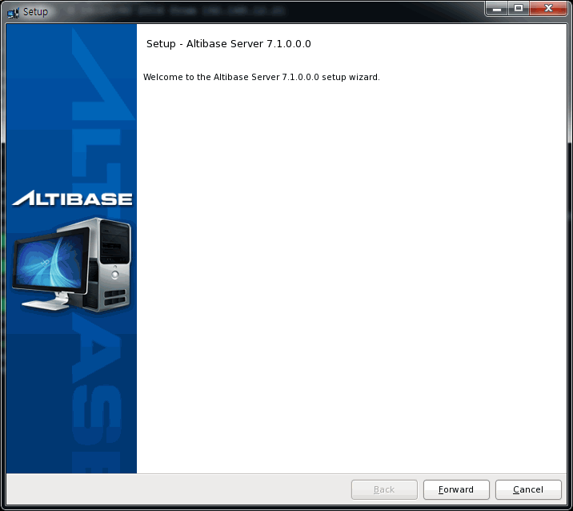
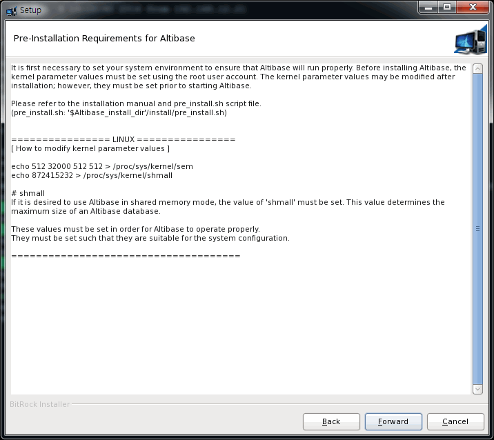
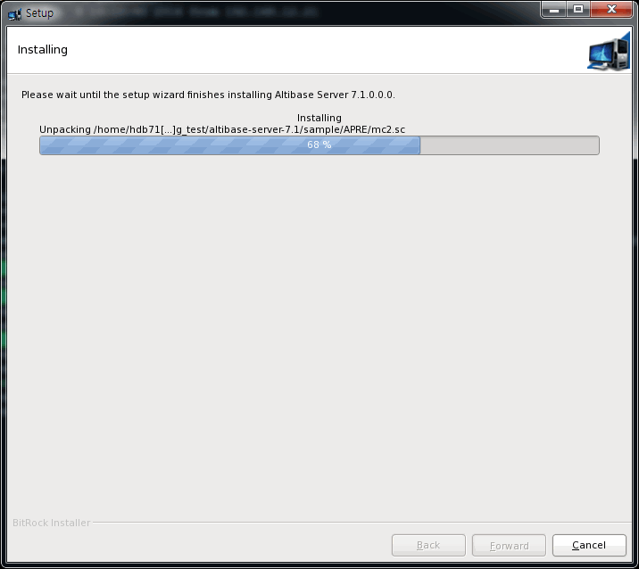
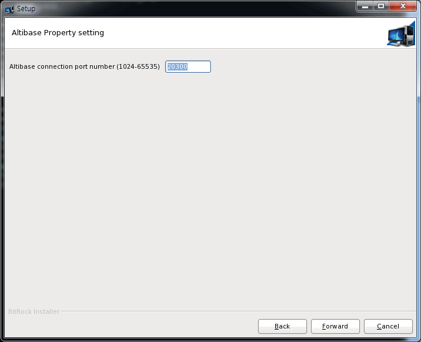
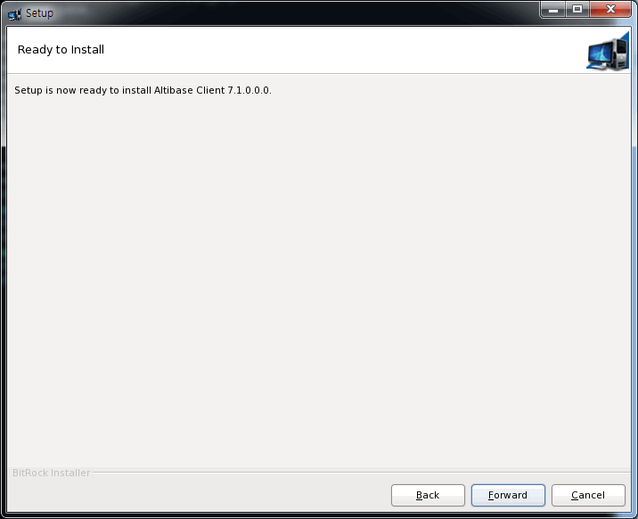

# 2.패키지 인스톨러를 이용한 제품 설치

이 장은 다음의 절을 포함한다.

- [시스템 요구사항](#시스템-요구사항)

- [Altibase 패키지 인스톨러](#altibase-패키지-인스톨러)

- [Altibase 제품 설치](#altibase-제품-설치)

- [Altibase 클라이언트 제품 설치](#altibase-클라이언트-제품-설치)


### 시스템 요구사항

Altibase를 설치하고 운영하기 위해서 필요한 시스템 요구사항은 다음과 같다.

이 장에서 언급되는 요구사항과 권장사항은 일반적인 용도의 데이터베이스를 가정한 것이다. 따라서 사용자의 데이터베이스 시스템이나 용도에 따라서 달라질 수 있으므로, 시스템 요구사항에 대한 자세한 사항은 [Altibase 고객서비스포털](http://support.altibase.com)로 문의한다.

#### 메모리

64-bit OS: 최소 1GB 이상 (권장: 2GB 이상, 최대 제한 없음)

#### CPU

1 CPU 이상 (권장: 2 CPU 이상)

#### 하드 디스크

Altibase가 사용하는 디스크에는 데이터를 저장하는 테이블스페이스, 트랜잭션 로그 저장과 Altibase 소프트웨어 설치에 필요한 충분한 공간이 있어야 한다. Altibase 소프트웨어와 트랜잭션 로그를 위한 공간은 적어도 각각 1GB 이상이어야 한다.

원활한 데이터베이스 운영을 위해서는 적어도 12 GB 이상의 디스크 여유 공간을 가지기를 권장한다.

#### 네트워크

이중화 기능 사용 시 전용선 사용을 권장한다.


### Altibase 패키지 인스톨러

#### Altibase 설치 기본 순서

Altibase 제품 설치하려면, 다음 단계대로 수행한다. 각 과정에 대한 상세한 설명은 운영 체제에 따른 제품 설치에서 자세히 설명한다.

1.  설치 환경 사전 확인

2.  Altibase 패키지 인스톨러 다운로드

3.  Altibase 패키지 인스톨러 실행

4.  설치 디렉터리 입력 및 설치 타입 선택

5.  Altibase 프로퍼티 설정

6.  Altibase 프로퍼티 확인

7.  Altibase 제품 설치

8.  Altibase 라이선스 입력

9.  Altibase 빠른 설정 가이드 미리 보기

10. 설치 완료

11. 설치 후 작업

#### 패키지 인스톨러 다운로드

[Altibase 고객지원서비스 포털](http://support.altibase.com/)을 방문하여 본인의 운영 체제에 적합한 인스톨러를 다운로드 받는다.

Altibase 패키지 인스톨러의 이름은 아래 예에서 보여주는 규칙을 따른다.

- Altibase 서버 패키지 인스톨러
:    altibase-server-7.3.0.0.0-LINUX-X86-64bit-release.run

- Altibase 클라이언트 패키지 인스톨러
:    altibase-client-7.3.0.0.0-LINUX-X86-64bit-release.run


Altibase 서버 패키지와 클라이언트 패키지는 다른 패키지로 분리되어 있다. 그러나 Altibase 서버 패키지는 클라이언트 패키지를 포함한다.

Altibase 패키지 인스톨러는 아래의 OS 별로 제공된다. 설치 전 아래의 명령어로 OS 관련 정보를 확인한 후 적절한 패키지 인스톨러를 선택한다.

```bash
$ uname -a
Linux rhel6-x64 2.6.32-71.el6.x86_64 #1 SMP Wed Sep 1 01:33:01 EDT 2010 x86_64 x86_64 x86_64 GNU/Linux
```

| OS                             | CPU                            | Version         | Bit (Server) | Bit (Client) |
| ------------------------------ | ------------------------------ | --------------- | ------------ | ------------ |
| AIX                            | PowerPC                        | 6.1 tl03 이상   | 64-bit       | 64-bit       |
| HP-UX                          | IA64                           | 11.31 이상      | 64-bit       | 64-bit       |
| LINUX                          | x86-64 (GNU glibc 2.12 ~ 2.33) | redhat 6.0 이상 | 64-bit       | 64-bit       |
| LINUX on Power                 | PowerPC 7                      | redhat 6.5 이상 | 64-bit       | 64-bit       |
| LINUX on Power (Little Endian) | PowerPC 8 (Little endian)      | redhat 7.2 이상 | 64-bit       | 64-bit       |
| Windows                        | -                              | 10 이상         | -            | 64-bit       |

Altibase 7.3 은 JDK 1.8이상에서 호환된다.

#### 설치 모드

제품을 설치하기 위해 Altibase 패키지 인스톨러는 다음 두 가지 모드로 시작할 수 있다.

-   대화형 커맨드 라인 모드: DISPLAY 환경변수를 설정하지 않았을 때 이 모드로 실행된다.
    
-   GUI (Graphical User Interface): DISPLAY 환경변수를 설정했을 때 이 모드로 실행된다.

### Altibase 제품 설치

이 절에서는 유닉스에서 Altibase 제품을 설치하는 방법을 설명한다.

-   [설치 환경 사전 확인](#설치-환경-사전-확인)

-   [패키지 인스톨러 다운로드](#패키지-인스톨러-다운로드_1)

-   [설치 모드 설정](#설치-모드-설정)

-   [Altibase 패키지 인스톨러 시작](#altibase-패키지-인스톨러-시작)

-   [설치 디렉터리 입력 및 설치 타입 선택](#설치-디렉터리-입력-및-설치-타입-선택)
    
-   [시스템 파라미터 확인](#시스템-파라미터-확인)

-   [Altibase 프로퍼티 설정](#altibase-프로퍼티-설정)

-   [설정한 프로퍼티 확인](#설정한-프로퍼티-확인)

-   [Altibase 제품 설치](#altibase-제품-설치_1)

-   [Altibase 라이선스 입력](#altibase-라이선스-입력)

-   [Altibase 빠른 설정 가이드 미리 보기](#altibase-빠른-설정-가이드-미리-보기)

-   [설치 종료](#설치-종료)

-   [설치 후 작업](#설치-후-작업)

#### 설치 환경 사전 확인

Altibase 패키지 인스톨러는 제품을 설치하기 전에 설치할 장비의 환경이 성공적인 설치를 위한 요구사항을 만족하는지를 알기 위해서 먼저 환경을 검사한다. 이 과정은 그래픽 유저 인터페이스로 보여 주지 않고 수행된다.

이 과정 중에 Altibase 패키지 인스톨러는 설치할 서버 장비에 대해서 다음의 정보를 확인한다.

-   운영 체제 이름과 버전

-   운영 체제의 모드 (64-bit)

Altibase 패키지 인스톨러가 확인한 정보와 일치하지 않으면, 에러 메시지를 반환하고 설치는 중단된다. 앞선 단계에서의 시스템 구성의 문제를 발견하는 것이 설치 중에 문제에 부딪힐 가능성을 줄여주기 때문이다.

#### 패키지 인스톨러 다운로드 

Altibase 패키지 인스톨러는 [Altibase 고객지원서비스 포털](http://support.altibase.com/)을 방문하여 본인의 운영 체제에 적합한 인스톨러를 다운로드 받는다.

Altibase가 제공하는 운영 체제별 인스톨러는 [패키지 인스톨러 다운로드](#패키지-인스톨러-다운로드)를 참조하기 바란다.

#### 설치 모드 설정

제품을 설치하기 위해 Altibase 패키지 인스톨러는 다음 두 가지 모드로 시작할 수 있다.

-   대화형 커맨드 라인 모드: DISPLAY 환경변수를 설정하지 않았을 때 사용한다.

-   GUI (Graphical User Interface): DISPLAY 환경변수를 설정했을 때 사용한다.

이 매뉴얼에서 Altibase 패키지 인스톨러는 설치 모드를 GUI로 설정하였다는 전제 하에 설명한다.

##### GUI 모드 설정

사용자는 Altibase 패키지 인스톨러를 GUI 모드로 실행할 수 있다. 호스트 컴퓨터에서 DISPLAY 환경변수를 다음과 같이 설정해야 한다.

```bash
$ setenv DISPLAY <machine name>:0.0
```

<machine_name>은 Altibase 패키지 인스톨러가 실행되는 것을 보여줄 컴퓨터의 IP주소 또는 호스트 이름이다. Cshell은 `setenv`를 사용하고, Korn Shell은 `export DISPLAY=<machine name>:0.0`으로 설정한다.

만약 호스트 컴퓨터가 아닌 원격지에서 Altibase 패키지 인스톨러가 GUI 모드로 실행되는 것을 볼 수 있게 허락하려면 원격 컴퓨터에서 아래의 명령어를 실행한다.

```bash
$ xhost +
```

#### Altibase 패키지 인스톨러 시작

유닉스 사용자는 Altibase 패키지 인스톨러를 다운로드 한 후 chmod로 파일의 권한을 변경해야 실행할 수 있다.

```bash
$ chmod +x altibase-server-7.3.0.0.0-LINUX-X86-64bit-release.run
```

Altibase 패키지 인스톨러를 실행한다.

```bash
$./altibase-server-7.3.0.0.0-LINUX-X86-64bit-release.run
```

<div class="image_description" markdown>
{ width=720 align=left } 
설치 모드를 GUI 모드로 설정하였다면, 왼쪽 이미지 같은 시작 패널이 보여진다.
</div>

#### 설치 디렉터리 입력 및 설치 타입 선택

<div class="image_description" markdown>
  { width=720 align=left } 
왼쪽의 설치 디렉터리 패널에서는 Altibase 홈 디렉터리, 즉 Altibase가 설치될 디렉터리와 패키지 설치 타입을 선택한다.<br>
Altibase 제품 설치를 원하는 경우 "Full Installation"을, 기존에 설치된 버전에 대한 패치를 원하는 경우 "Patch Installation"을 선택한다.
</div>

<div class="image_description" markdown>
  { width=720 align=left } 
사용자가 입력한 디렉터리에 Altibase 제품이 이미 설치되어 있다면, 경고 메시지가 다이얼로그 박스에 보여진다. 이 경우 다른 디렉터리를 선택하든지, 그 디렉터리에 설치된 제품을 먼저 언인스톨 해야한다.
</div>

#### 시스템 파라미터 확인

<div class="image_description" markdown>

{ width=720 align=left } 

왼쪽의 커널 이미지는 설정해야 할 시스템 커널 파라미터와 어떻게 설정하는지를 보여준다. <br>시스템 커널 파라미터 설정은 root 계정으로 수행해야 한다. 또한 어떤 시스템은 커널 파라미터 설정 후에 재부팅이 필요할 수도 있다.
!!! tip
    커널 파라미터 설정은 다음 설치 단계로 넘어가기 전에 수동으로 하길 권한다. 만약 설치 완료 후에 설정하려면, $ALTIBASE_HOME/install/pre_install.sh 파일을 참고하기 바란다.

</div>

Altibase가 올바르게 실행될 것을 보장하기 위해서 먼저 시스템 환경을 설정할 필요가 있다.<br>
Altibase 설치 전에 root 사용자 권한으로 커널 파라미터 값을 조정해야 한다. 커널 파라미터 값은 설치 후에 설정해도 되지만 Altibase를 구동하기 전에는 설정해야 한다.
아래는 각 OS별 시스템 커널 파라미터의 권장 값을 보여주는 예제이다. OS별 커널 파라미터에 대한 자세한 설명은 부록에 있는 "[설치 전 확인 사항](A.부록-설치-전-확인-사항.md)"을 참조한다.

!!! example
    === "HPUX"
        ```bash
        [ Recommended Kernel Parameter Values ]

        shmmax = 2147483648
        shmmni = 500 
        shmseg = 200 
        semmap = 1001
        semmni = 1000
        semmns = 4096
        semmnu = 1000
        semume = 1000
        max_thread_proc = 600
        maxusers = 64
        dbc_min_pct = 5
        dbc_max_pct = 5
        maxdsiz = 1073741824
        maxdsiz_64bit = 4294967296 
    
        # maxdsiz_64bit
        The Altibase server needs sufficient memory space to function properly.
        Please set the value to 70% of system memory or greater.
    
        # dbc_min_pct and dbc_max_pct 
        dbc_min_pct and dbc_max_pct were renamed filecache_min and filecache_max, respectively, in HP version 11.31 and subsequent releases.
    
        [ How to modify kernel parameter values ] 
    
        /usr/sbin/kmtune -s shmmax=2147483648
        /usr/sbin/kmtune -s shmmni=500 
        /usr/sbin/kmtune -s shmseg=200
        /usr/sbin/kmtune -s semmap=1001 
        /usr/sbin/kmtune -s semmni=1000
        /usr/sbin/kmtune -s semmns=4096 
        /usr/sbin/kmtune -s semmnu=1000
        /usr/sbin/kmtune -s semume=1000
        /usr/sbin/kmtune -s max_thread_proc=600
        /usr/sbin/kmtune -s maxusers=64
        /usr/sbin/kmtune -s dbc_min_pct=5
        /usr/sbin/kmtune -s dbc_max_pct=5
        /usr/sbin/kmtune -s maxdsiz=1073741824 
        /usr/sbin/kmtune -s maxdsiz_64bit=4294967296
    
        # maxdsiz_64bit
        The Altibase server needs sufficient memory space in order to function properly.
        Please set the value to 70% of system memory or greater.
    
        # dbc_min_pct and dbc_max_pct 
        dbc_min_pct and dbc_max_pct were renamed filecache_min and filecache_max, respectively, in HP version 11.31 and subsequent releases.
        ```
    === "LINUX"
        ```bash
        [ How to modify kernel parameter values ]
    
        echo 512 32000 512 512 > /proc/sys/kernel/sem
        ```
    === "AIX"
        ```bash
        [ Recommended Kernel Parameter Values ]
    
        fsize = -1
        data = -1
        rss = -1
    
        Maximum number of PROCESSES allowed per user
            = greater than the value set using the Altibase property MAX_CLIENT
    
        Size of the File System BufferCache
            = less than 20% of total memory.
    
        AIO = Available
    
        AMO = AIX version 5.2 ML04 and above
                    lru_file_repage=0
                    strict_maxclient%=0
                    = Versions prior to AIX version 5.2 ML04
                    lru_file_repage=0
    
        [ How to modify kernel parameter values ]
    
        Edit /etc/security/limits file
        Set fsize, data and rss variables.
    
        Run 'smit'
            1) System Environments
            System Environments -> Change / Show Characteristics Of Operating System
            Change : 
                Maximum number of PROCESSES allowed per user
                    = bigger than the value set using the Altibase property MAX_CLIENT
                Size of the File System BufferCache
                    = less than 20% of total memory.
            2) AIO 
                Device -> Asynchronous I/O -> Posix Asynchronous I/O -> Configure Defined Asynchronous I/O
                Change : posix_aio0=Available
    
            3) AMO 
                Performance & Resource Scheduling -> Tuning Kernel & Network Parameters -> Tuning Virtual Memory Manager, File System and Logical Volume 
                    Manager Params ->
                    + List All Characteristics of Current Parameters --- Check
                    + Change / Show Current Parameters --- Current Change
                    + Change / Show Parameters for Next Boot --- Change upon Reboot
    
                The case of AIX version 5.2 ML04 and above :
                    Change : lru_file_repage=0
                        strict_maxclient%=0
                The case of Versions prior to AIX version 5.2 ML04 :
                    Change : lru_file_repage=0
        ```

#### Altibase 프로퍼티 설정

Altibase 프로퍼티를 설정하는 단계는 다음의 세 단계로 구분된다.

[Step 1: Basic Database Operation Properties](#step-1-basic-database-operation-properties)

[Step 2: Database Creation Properties](#step-2-database-creation-properties)

[Step 3: Set Database Directories](#step-3-set-database-directories)

##### Step 1: Basic Database Operation Properties
<div class="image_description" markdown>
{width=720 align=left}

-   데이터베이스 이름
-   연결 포트 번호
-   메모리 데이터베이스의 최대 크기
-   버퍼 크기
-   새로운 데이터베이스를 생성하기 위한 SQL 스크립트를 생성할 것인지를 지정 (즉 2단계를 수행할 지 말지)<br>

    !!! tip
        YES를 선택하면 2단계를 수행하고, 그렇지 않으면 2단계를 건너뛴다. 이 과정을 이용해서 SQL 스크립트가 생성되는지에 상관없이, 새로운 데이터베이스는 다음 구문을 사용해서 생성할 수 있다.<br>
        ```bash
        server create [DB Character-set] [National Character-set]
        ```
</div>

##### Step 2: Database Creation Properties
<div class="image_description" markdown>
{width=720 align=left}

-   초기 데이터베이스 이름
-   데이터베이스 아카이브 로깅 모드
    - Noarchivelog
    - Archivelog
-   데이터베이스 문자 셋
    - MS949
    - US7ASCII
    - KO16KSC5601
    - BIG5
    - GB231280
    - MS936
    - UTF-8
    - SHIFT-JIS
    - MS932
    - EUC-JP
-   국가 문자 셋
    - UTF-16
    - UTF-8
    </div> 
    !!! tip
    2단계에서 생성된 SQL 스크립트는 \$ALTIBASE_HOME/install/post_install.sh 파일에 저장된다.

##### Step 3: Set Database Directories

<div class="image_description" markdown>
{width=720 align=left}

-   기본 디스크 데이터베이스 디렉터리

-   메모리 데이터베이스 디렉터리

-   아카이브 로그 디렉터리

-   트랜잭션 로그 디렉터리

-   로그 앵커 파일 디렉터리

이 단계에 포함되지 않은 프로퍼티의 값을 설정하거나 단계1 또는 단계3에서 설정한 프로퍼티 값을 나중에 변경하려면, $ALTIBASE_HOME/conf/altibase.propertites 파일을 수동으로 편집하면 된다.
</div>

#### 설정한 프로퍼티 확인

<div class="image_description" markdown>
{width=720 align=left}

왼쪽 패널은 전 과정에서 설정한 프로퍼티의 값을 보여준다.
</div>

??? example
    
    ```
    To change these properties after installation is complete, 
    please modify the following file:
    /home/hdb71_p/pkg_test/altibase-server-7.3/conf/altibase.properties.
    
    1. Altibase Property Settings:  
        Step 1: Basic Database Operation Properties
    
    1) Database name: 
         [mydb]
    2) Altibase connection port number (1024-65535): 
         [20300]
    3) Maximum size of memory database:
         [2G]
    
    4) Buffer area size for caching disk-based database pages:
         [128M]
    
    2. Altibase Property Settings:
        Step 2: Database Creation Properties
    
    1) Initial database size
         [10M]
    
    2) Database archive logging mode
         [noarchivelog]
    
    3) Database character set
         [UTF8]
    
    4) National character set
         [UTF8]
    
    3. Altibase Property Settings:
        Step 3: Set Database Directories
    
    The database will not operate properly if any of these directories are removed.
    
    1) Disk database directory: 
         [/home/hdb71_p/pkg_test/altibase-server-7.3/dbs] 
    
    2) Memory database directory:
         [/home/hdb71_p/pkg_test/altibase-server-7.3/dbs] 
    
    3) Archive log directory: 
         [/home/hdb71_p/pkg_test/altibase-server-7.3/arch_logs] 
    
    4) Transaction log directory: 
         [/home/hdb71_p/pkg_test/altibase-server-7.3/logs] 
    
    5) Log Anchor file directories:
         Directory 1: 
         [/home/hdb71_p/pkg_test/altibase-server-7.3/logs] 
    
         Directory 2: 
         [/home/hdb71_p/pkg_test/altibase-server-7.3/logs] 
    
         Directory 3: 
         [/home/hdb71_p/pkg_test/altibase-server-7.3/logs] 
    ```

<div class="image_description" markdown>
{width=720 align=left}
이 값들을 확인 후에, “Forward” 를 클릭하면 “Ready to Install” 패널이 왼쪽처럼 보여질 것이다.<br>
설치를 계속하려면 “Forward”를 누른다.
</div>


#### Altibase 제품 설치

<div class="image_description" markdown>
{width=720 align=left}

설치가 완료되면, 인스톨러는 아래의 작업들을 GUI 화면 없이 수행한다.

-   설정한 프로퍼티가 altibase.properties 파일에 업데이트 된다.

-   Altibase 서버 구동을 위한 기본 환경이 수록되어 있는 altibase_user.env 파일이 $ALTIBASE_HOME/conf 디렉터리에 생성된다. 그리고 이 파일을 실행하는 명령어가 사용자 계정의 환경 설정 파일(.bashrc 또는 .bash_profile 또는 .profile 등)에 추가된다.
</div>


아래는 altibase_user.env 파일과 사용자 환경 설정 파일 .bash_profile의 예제이다.

=== "altibase_user.env"
    ```bash
    ALTIBASE_HOME=/home/hdb71_p/pkg_test/altibase-server-7.3;export ALTIBASE_HOME 
    PATH=${ALTIBASE_HOME}/bin:${PATH};export PATH 
    LD_LIBRARY_PATH=${ALTIBASE_HOME}/lib:${LD_LIBRARY_PATH};export LD_LIBRARY_PATH 
    CLASSPATH=${ALTIBASE_HOME}/lib/Altibase.jar:${CLASSPATH};export CLASSPATH 
    ```
=== ".bash_profile"
    ```bash
    . /home/hdb71_p/pkg_test/altibase-server-7.3/conf/altibase_user.env
    ```

#### Altibase 라이선스 입력

<div class="image_description" markdown>
{width=720 align=left}

왼쪽은 Altibase의 라이선스 키를 입력하는 화면이다. Altibase 패키지 인스톨러는 라이선스 키를 입력하는 다음 세 가지 방법을 제공한다.

-   라이선스 키를 직접 입력

-   라이선스 키가 저장된 파일 선택

-   라이선스 추후 등록: 라이선스 키를 아직까지 얻지 못했다면, 나중에 라이선스 키를 획득한 후, $ALTIBASE_HOME/conf 디렉터리에 새 라이선스 파일을 복사하면 된다.
    ```
    $ cp license $ALTIBASE_HOME/conf/
    ```
    !!! note
    이 과정에서 라이선스 키를 등록하지 않으면 다음 단계에서 데이터베이스를 생성할지 여부를 묻지 않는다.
    </div>

#### Altibase 빠른 설정 가이드 미리 보기

Altibase 빠른 설정 가이드 패널은 설치 성공 후에 Altibase를 어떻게 구동할 것인지를 안내한다.

Altibase 패키지 인스톨러는 사용자들이 좀 더 쉽게 시스템 커널 파라미터와 환경변수를 설정하도록 다음의 두 쉘 스크립트를 제공한다.

-   $ALTIBASE_HOME/install/pre_install.sh  
    이 스크립트는 필수 시스템 커널 파라미터의 최소 집합을 포함하며, 그들의 권장 값과 어떻게 설정하는지에 대해서 설명한다.
    
-   $ALTIBASE_HOME/install/post_install.sh  
    이 스크립트는 Altibase 프로퍼티 설정 과정에서 단계2를 수행했다면 새로운 데이터베이스를 생성하기 위한 SQL 스크립트를 포함한다.
    
-   $ALTIBASE_HOME/packages/catproc.sql  
    이 스크립트는 PSM을 사용하기 위한 SQL 스크립트를 포함한다.

다음 패널에서 체크 박스를 선택하면 Altibase 패키지 인스톨러는 새로운 데이터베이스를 생성하고 PSM을 사용하기 위한 스크립트를 실행할 것이며, 이로 인해 설치 시간이 조금 더 소요될 것이다. 체크 박스를 선택하지 않을 경우, 제품 설치 후에 수동으로 데이터베이스 생성 및 PSM 스크립트를 실행해야 한다.

<div class="image_description" markdown>
{width=720 align=left}
</div>

??? example
    ```bash
    [  Installation complete  ]
    Please refer to the file listed below to verify the Altibase version.
     /home/hdb71_p/pkg_test/altibase-server-7.3/APatch/patchinfo 

    [ Quick Guide to Making Settings in Altibase ] 
    
    1. Set kernel variables using the root user account.
        run the '/home/hdb71_p/pkg_test/altibase-server-7.3/install/pre_install.sh' file 
        - This script helps you make kernel parameter settings.
    
    ================ LINUX ================
    [ How to modify kernel parameter values ]
    
    echo 512 32000 512 512 > /proc/sys/kernel/sem
    
    These values must be set in order for Altibase to operate properly.
    They must be set such that they are suitable for the system configuration.
    
    =====================================


    2. Provide a license.
        Please rename and locate the license file as shown below.
        /home/hdb71_p/pkg_test/altibase-server-7.3/conf/license 
    
        If no license file has been issued, or if the license file has expired,
        Altibase services will not start.
        In this case, please visit http://support.altibase.com.


    3. Configure user environment variables (using the user account with 
        which Altibase was installed).
        Run the '/home/hdb71_p/pkg_test/altibase-server-7.3/install/post_install.sh' file 
        under the account with which Altibase was installed.
    
        This script performs necessary post-installation configuration. 
    
        1) Create the Altibase user environment file and apply it to the user profile.
             (/home/hdb71_p/pkg_test/altibase-server-7.3/conf/altibase_user.env)
        2) Create a database.
    
             If you selected 'YES' in response to the question about whether to create 
             a database after installation, at "Altibase Property setting step 1", 
             a database will be automatically created.
    
             If you selected 'NO' in response to this question,
             you need to create a database manually.
    
             shell> server create [DB Character Set] [National Character Set]
    
    4. Start up and shut down the server
        shell> server start
        shell> server stop
    
    5. Runs all scripts required for or used with PSM
    Run the '/home/hdb71_p/pkg_test/altibase-server-7.3/packages/catproc.sql' file.
    
    6. Connect to the database using iSQL
        shell> isql -s 127.0.0.1 -u SYS -p MANAGER
    ```


아래의 창은 데이터베이스 생성 중에 나타나는 화면이다.


#### 설치 종료

<div class="image_description" markdown>
{width=720 align=left}
성공적인 설치 후 왼쪽 패널이 나타난다.
</div>

<div class="image_description" markdown>
{width=720 align=left}
Finish 버튼을 누르면 왼쪽과 같이 환경 설정 가이드 화면이 나타난다.
</div>

#### 설치 후 작업

성공적인 설치 후, 아래의 작업을 해야 한다.

1.  시스템 커널 파라미터를 설치 과정 중에 설정하지 않았다면, 수동으로 이를 설정한다. $ALTIBASE_HOME/install/pre_install.sh 파일을 참고한다.
    
2.  로그인 쉘 스크립트를 실행시키기 위해서, 다음 중 하나를 수행한다.
    - 로그아웃 후 다시 로그인
    - . ~/.bash_profile 실행
    - source ~/.bash_profile 실행

3. 인스톨러 설치 단계에서 데이터베이스 생성을 하지 않은 경우, 아래와 같이 생성한다.
    - 설치 단계에서 데이터베이스 생성을 위한 프로퍼티를 입력한 경우, $ALTIBASE_HOME/install/post_install.sh 스크립트를 실행하라.  
    
    ```bash
    $ sh post_install.sh dbcreate
    ```
  
    - 설치 단계에서 데이터베이스 생성을 위한 프로퍼티를 입력하지 않은 경우, server 스크립트를 실행하라.  
    
    ```bash
    $ server create utf8 utf8
    ```
  
    - 설치단계에서 PSM 사용을 위한 프로퍼티를 입력하지 않은 경우, catproc.sql 을 실행하라.  
    
    ```sql
    $ isql -s 127.0.0.1 -u sys -p manager -silent -f
    ${ALTIBASE_HOME}/packages/catproc.sql
    ```

### Altibase 클라이언트 제품 설치

Altibase 제품을 설치하는 방법을 다음의 절에서 설명한다.

-   설치 환경 사전 확인

-   Altibase 패키지 인스톨러 다운로드

-   설치 모드 설정

-   Altibase 패키지 인스톨러 시작

-   설치 디렉터리 입력 및 설치 타입 선택

-   Altibase 클라이언트 프로퍼티 설정

-   Altibase 클라이언트 제품 설치

-   설치 종료

-   설치 후 작업

#### 설치 환경 사전 확인

“Altibase 제품 설치”절 내의 "설치 환경 사전 확인"을 참고한다.

#### Altibase 패키지 인스톨러 다운로드

Altibase 패키지 인스톨러는 [Altibase 고객지원서비스 포털](http://support.altibase.com/)을 방문하여 본인의 운영 체제에 적합한 인스톨러를 다운로드 받는다.

Altibase가 제공하는 운영 체제별 인스톨러는 [패키지 인스톨러 다운로드](#패키지-인스톨러-다운로드)를 참조하기 바란다.

#### 설치 모드 설정

유닉스 시스템에서 GUI 모드로 패키지 인스톨러를 시작하려면 “Altibase 제품 설치”절 내의 “설치 모드 설정"을 참고한다.

#### Altibase 패키지 인스톨러 시작

유닉스 사용자는 Altibase 패키지 인스톨러를 다운로드 한 후 chmod로 파일 권한을 변경해야 실행할 수 있다.

```bash
$ chmod +x altibase-client-7.3.0.0.0-LINUX-X86-64bit-release.run
```

Altibase 패키지 인스톨러를 실행한다.

```bash
$./altibase-client-7.3.0.0.0-LINUX-X86-64bit-release.run
```

<div class="image_description" markdown>
{width=720 align=left}
설치 모드를 GUI 모드로 설정하였다면, 왼쪽과 같은 시작 패널이 보여진다.
</div>

#### 설치 디렉터리 입력 및 설치 타입 선택

<div class="image_description" markdown>
{width=720 align=left}
아래 설치 디렉터리 패널에서는 Altibase 홈 디렉터리, 즉 Altibase 클라이언트 제품이 설치될 디렉터리와 클라이언트 패키지 설치 타입을 선택한다.<br>
Altibase 클라이언트 설치를 원하는 경우 “Full Installation” 를, 기존 설치되어 있는 버전에 대한 패치를 원하는 경우 “Patch Installation” 를 선택한다.
</div>

#### Altibase 클라이언트 프로퍼티 설정

<div class="image_description" markdown>
{width=720 align=left}
Altibase 클라이언트 프로퍼티 패널에서는 클라이언트가 TCP/IP로 서버에 접속할 때 사용할 통신 포트 번호를 입력한다. 이 포트 번호는 .profile 또는 .bash_profile 같은 사용자 계정의 환경 설정 파일에 저장된다.
</div>

#### Altibase 클라이언트 제품 설치
<div class="image_description" markdown>
{width=720 align=left}
계속 진행하려면 "Forward"를 누른다.
</div>
<div class="image_description" markdown>
{width=720 align=left}
</div>
<div class="image_description" markdown>
{width=720 align=left}
이 과정 동안 왼쪽의 다이얼로그 박스에서 보여주는 Altibase 클라이언트 제품과 관련 있는 환경 변수는 로그인 쉘 (예를 들어, 표준 본 쉘을 위한 기본 환경 파일은 .profile이다)을 위한 환경 파일에 추가된다.
</div>

Altibase 서버 제품 설치 시에 생성되는 altibase_user.env 파일은 여기에서는 생성되지 않는다. 새로운 환경 변수를 적용하려면, 다음 중 하나를 수행한다.

- 로그 아웃 후 다시 로그인

- . ~/.profile 실행

- source ~/.profile 실행

??? example ".profile 예시"
    ```bash
    # ALTIBASE_ENV
    export ALTIBASE_HOME=/home/hdb71_p/altibase-client-7.3.0
    export ALTIBASE_PORT_NO=20300
    export PATH=$ALTIBASE_HOME/bin:$PATH
    export LD_LIBRARY_PATH=${ALTIBASE_HOME}/lib:${LD_LIBRARY_PATH}
    export CLASSPATH=${ALTIBASE_HOME}/lib/Altibase.jar:${CLASSPATH}
    ```

#### 설치 종료


#### 설치 후 작업

위의 과정에서 환경변수가 쉘에 적용되지 않았다면, 지금 한다. 자세한 설명은 위의 “Altibase 클라이언트 제품 설치” 절을 참고한다.

