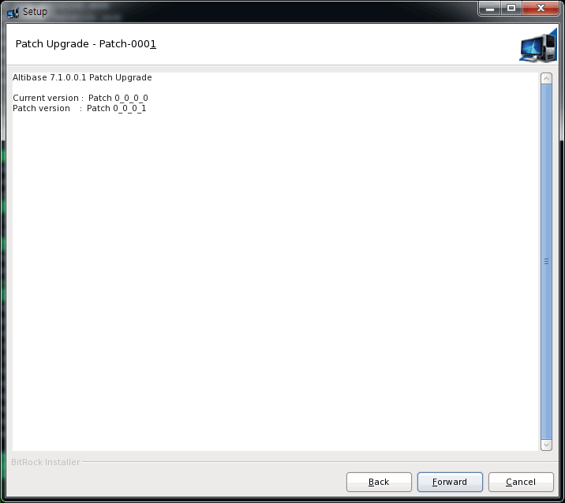
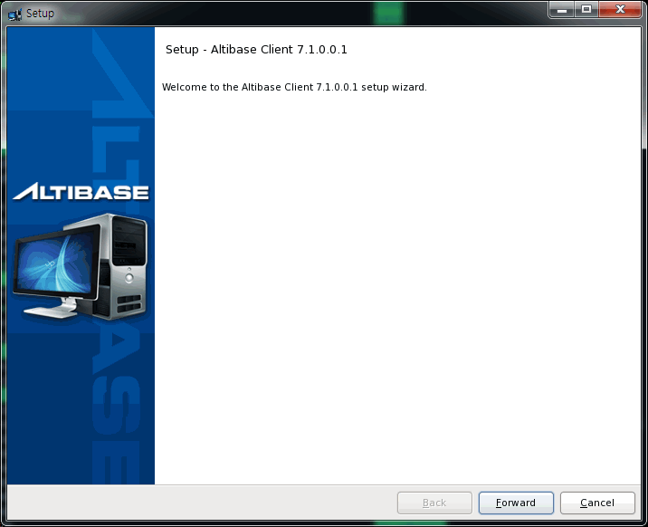
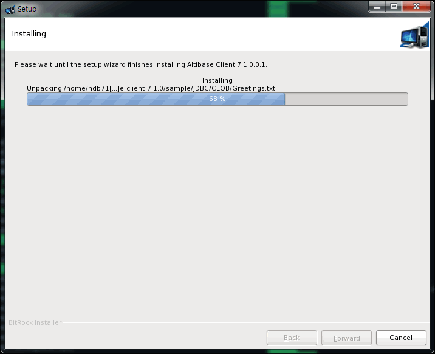

# 4.패키지 인스톨러를 이용한 제품 패치

이 장은 다음의 절을 포함한다.

-   [패치란?](#패치란)

-   [Altibase 서버 제품 패치](#altibase-서버-제품-패치)

-   [Altibase 클라이언트 제품 패치](#altibase-클라이언트-제품-패치)

### 패치란?

패치는 존재하는 설치를 덮어 쓸 파일들의 작은 모음이다. 패치는 Altibase 제품의 특정 버전과 연관이 있다. 패치는 어떤 버그에 대한 대응으로 고객이 사용할 수 있도록 버그를 수정한 것이다. 패치를 적용하려면 베이스 릴리스 또는 패치세트가 먼저 설치되어 있어야 한다.

#### Altibase 제품의 설치 유형

*표 1 Full 패키지와 패치 패키지 비교*

|단계                              |Full 패키지|패치 패키지|
|----------------------------------|:---------:|:-------:|
|설치 환경 사전 확인                | ○          | ○       |
|Altibase 패키지 인스톨러 시작      | ○          | ○       |
|시스템 파라미터 확인               | ○          |         |
|설치 디렉터리 입력                 | ○          | ○       |
|패치 버전 확인                    |            | ○        |
|Altibase 프로퍼티 설정            | ○          |          |
|설정한 프로퍼티 확인               | ○          |          |
|Altibase 제품 설치                | ○          | ○        |
|Altibase 라이선스 입력            | ○          |           |
|Altibase 빠른 설정 가이드 미리 보기| ○          |           |
|설치 종료                         | ○          | ○         |


#### Altibase 클라이언트 제품의 설치 타입

*표 2 Full 패키지와 패치 패키지 비교*

| 단계                          | Full 패키지 | 패치 패키지 |
|------------------------------|:-----------:|:-----------:|
| 설치 환경 사전 확인           | ○           | ○           |
| Altibase 패키지 인스톨러 시작 | ○           | ○           |
| 설치 디렉터리 입력            | ○           | ○           |
| 패치 버전 확인                |             | ○           |
| Altibase 프로퍼티 설정        | ○           |             |
| Altibase 제품 설치            | ○           | ○           |
| 설치 종료                     | ○           | ○           |

### Altibase 서버 제품 패치

아래 절에서 Altibase 서버 패치를 어떻게 적용하는지 설명한다.

#### 설치 환경 사전 확인

유닉스에서 "[설치 환경 사전 확인](../Installation%20Guide/2.패키지-인스톨러를-이용한-제품-설치.md#설치-환경-사전-확인)" 절을 참고한다.

#### Altibase 패키지 인스톨러 다운로드 

Altibase는 제품 패치를 위한 설치 파일이 따로 존재하지 않는다. 인스톨러를 시작할 때 설치 형태를 풀(full) 패키지 또는 패치로 선택할 수 있다.

[Altibase 고객지원서비스 포털](http://support.altibase.com/)을 방문하여 본인의 운영 체제에 적합한 인스톨러를 다운로드 받는다.

#### 설치 모드 설정

GUI 모드로 패키지 인스톨러를 설치하려면 “Altibase 제품 설치”절 내의 “[설치 모드 설정](../Installation%20Guide/2.패키지-인스톨러를-이용한-제품-설치.md#설치-모드-설정)"을 참고한다.

#### Altibase 패키지 인스톨러 시작

유닉스 사용자는 Altibase 패키지 인스톨러를 다운로드 한 후 chmod로 파일 권한을 변경해야 실행할 수 있다.

```bash
$ chmod +x altibase-server-7.3.0.0.1-LINUX-X86-64bit-release.run
```

Altibase 패키지 인스톨러를 실행한다.

```bash
$./altibase-server-7.3.0.0.1-LINUX-X86-64bit-release.run
```

<div class="image_description" markdown>
{width=720px align=left}
설치 모드를 GUI 모드로 설정하였다면, 왼쪽과 같은 시작 패널이 보여진다.
</div>


#### 설치 디렉터리 입력 및 설치 타입 선택

설치 디렉터리 패널에서 패치 버전이 적용될 Altibase 홈 디렉터리를 입력하고, 설치 형태를 패치(patch)로 선택한다.

패치를 적용하기 전에 베이스 릴리스가 설치되어 있어야 한다. Altibase 제품이 사용자가 지정한 디렉터리에 설치되어 있지 않다면, 경고 메시지를 보여주는 다이얼로그 박스가 나타난다.

그러나 “Install Type”에서 “Full Installation”을 선택하면 Altibase 서버 제품 설치할 때와 설치 단계가 동일하다. “[Altibase 제품 설치](../Installation%20Guide/2.패키지-인스톨러를-이용한-제품-설치.md#altibase-제품-설치)” 를 참고하기 바란다.

=== "Full Installation 선택"
    

=== "Patch 선택"
    


#### 패치 버전 확인

<div class="image_description" markdown>
{width=720px align=left}
이 패널은 선택한 디렉터리에 현재 설치된 Altibase 제품의 패치 버전과 적용할 패치의 버전을 보여준다.
</div>

#### Altibase 제품 설치


#### 설치 완료


### Altibase 클라이언트 제품 패치

아래 절에서 Altibase 클라이언트 패치를 어떻게 적용하는지 설명한다.

#### 설치 환경 사전 확인

앞서 설명한 Altibase 서버 제품 패치시의 "[설치 환경 사전 확인](#설치-환경-사전-확인)” 절을 참고한다.

#### Altibase 패키지 인스톨러 다운로드 

Altibase는 제품 패치를 위한 설치 파일이 따로 존재하지 않는다. 인스톨러를 시작할 때 설치 형태를 풀 패키지 또는 패치로 선택할 수 있다.

[Altibase 고객지원서비스 포털](http://support.altibase.com/)을 방문하여 본인의 운영 체제에 적합한 인스톨러를 다운로드 받는다.

#### 설치 모드 설정

GUI 모드로 패키지 인스톨러를 설치하려면 “Altibase 제품 설치”절 내의 “[설치 모드 설정](#설치-모드-설정)"을 참고한다.

#### Altibase 패키지 인스톨러 시작

유닉스 사용자는 Altibase 패키지 인스톨러를 다운로드 한 후 chmod로 파일 권한을 변경해야 실행할 수 있다.

```bash
$ chmod +x altibase-client-7.3.0.0.1-LINUX-X86-64bit-release.run
```

Altibase 패키지 인스톨러를 실행한다.

```bash
$./altibase-client-7.3.0.0.1-LINUX-X86-64bit-release.run
```

<div class="image_description" markdown>
{width=720px align=left}
설치 모드를 GUI 모드로 설정하였다면, 왼쪽과 같은 시작 패널이 보여진다.
</div>

#### 설치 디렉터리 입력 및 설치 타입 선택

설치 디렉터리 패널에서 패치 버전이 적용될 Altibase 홈 디렉터리를 입력하고, 설치 형태를 패치(patch)로 선택한다.

패치를 적용하기 전에 베이스 릴리스가 설치되어 있어야 한다. Altibase 제품이 사용자가 지정한 디렉터리에 설치되어 있지 않다면, 경고 메시지를 보여주는 다이얼로그 박스가 나타난다.

그러나 “Install Type”에서 “Full Installation” 를 선택하면 Altibase 클라이언트 제품 설치할 때와 설치 단계가 동일하다. “[Altibase 클라이언트 제품 설치](../Installation%20Guide/2.패키지-인스톨러를-이용한-제품-설치.md#altibase-클라이언트-제품-설치)”를 참고하기 바란다.

=== "Full Installation 선택"
    

=== "Patch 선택"
    

#### 패치 버전 확인

이 패널은 선택한 디렉터리에 현재 설치된 Altibase 제품의 패치 버전과 적용할 패치의 버전을 보여준다.

<div class="image_description" markdown>
{width=720px align=left}
이 패널은 선택한 디렉터리에 현재 설치된 Altibase 제품의 패치 버전과 적용할 패치의 버전을 보여준다.
</div>

#### Altibase 제품 설치



#### 설치 완료

